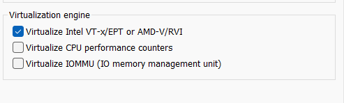
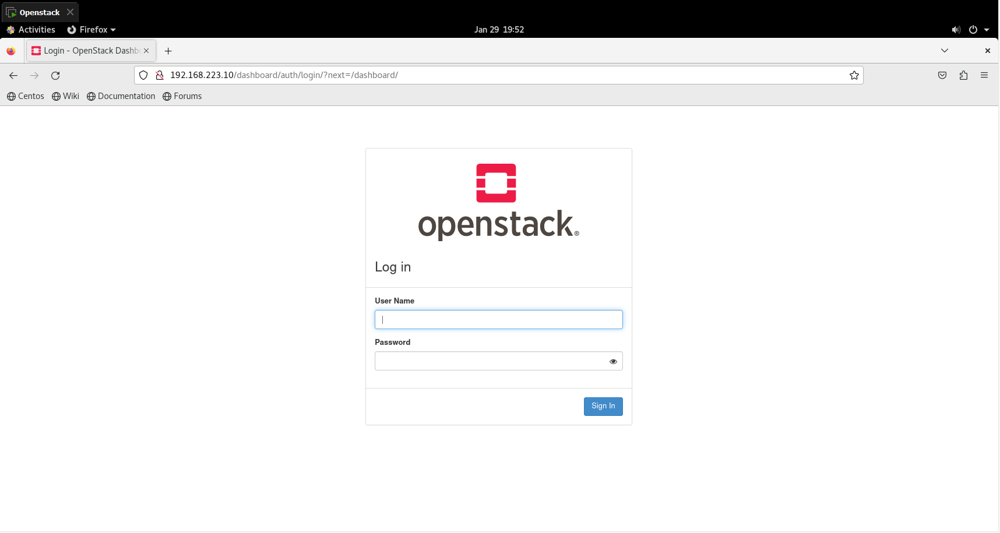
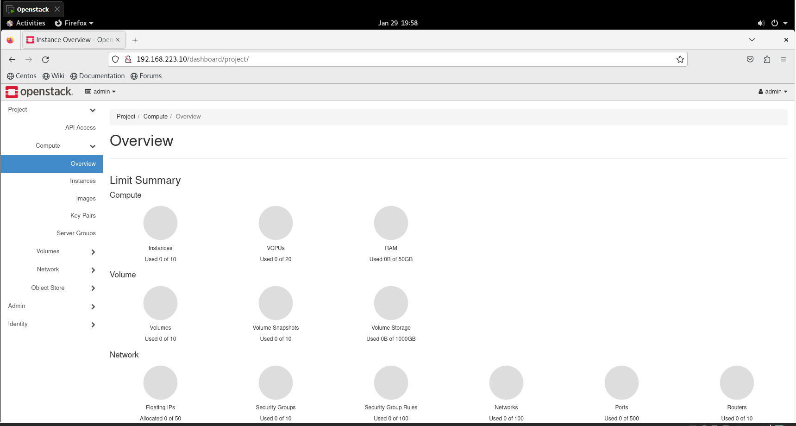

# OpenStack RDO Deployment

This project aims to deploy OpenStack using the RDO (Red Hat Distribution OpenStack) distribution. Below are the steps to deploy OpenStack on CentOS 8.

## Host Preparation

1. **Image**: [Download CentOS 8 Image](https://dakhli-permenant.oss.eu-west-0.prod-cloud-ocb.orange-business.com/ITI_Course/CentOS-Stream-8-x86_64-20230112-dvd1.iso)
2. **Enable Virtualization** 

3. **Network Configuration**: 
   - Ensure two network interface cards (NICs) are available and configured manually with static IPs. Disable IPv6.
   - After installation, check reachability with `ping 8.8.8.8`.
   - Verify NICs have static IP configurations: `cat /etc/sysconfig/network-scripts`.
4. **Firewall and Network Manager**: 
   - Stop and disable Firewall: `systemctl disable firewalld; systemctl stop firewalld`.
   - Stop and disable Network Manager: `systemctl disable NetworkManager; systemctl stop NetworkManager`.
5. **Install network-scripts**: `dnf install -y network-scripts`.
6. **Enable and Start Network Service**: 
   - Enable: `systemctl enable network`.
   - Start: `systemctl start network`.
7. **Hostname Configuration**:
   - Set hostname: `hostnamectl set-hostname openstack.iti`.
   - Update `/etc/hosts` with the new hostname and IP address.
8. **SELinux**: 
   - Disable SELinux: `setenforce 0`.
   - Update SELinux configuration: `sed -i 's/SELINUX=.*/SELINUX=disabled/' /etc/selinux/config`.
   
## OpenStack Installation

1. **Enable Powertools Repository**: `dnf config-manager --enable powertools`.
2. **Install OpenStack Release Package**: `dnf install -y centos-release-openstack-yoga`.
3. **System Update**: `dnf -y update`.
4. **Install Packstack Installer**: `dnf install -y openstack-packstack`.
5. **Run Packstack Installation**:
   - Generate answer file: `packstack --gen-answer-file=/root/answers.txt --os-neutron-l2-agent=openvswitch --os-neutron-ml2-mechanism-drivers=openvswitch --os-neutron-ml2-tenant-network-types=vxlan --os-neutron-ml2-type-drivers=vxlan,flat --provision-demo=n --os-neutron-ovs-bridge-mappings=extnet:br-ex --os-neutron-ovs-bridge-interfaces=br-ex:ens192 --keystone-admin-passwd=redhat  --os-heat-install=n`.
   - Run Packstack: `packstack --answer-file=/root/answers.txt -t 3600`.
   - Ensure `br-ex` and `ens192` interfaces are configured correctly.

## Validation

### 1. Validation through Dashboard

Access the OpenStack dashboard (Horizon) via a web browser using the IP address of the br-ex interface. You can typically find this IP address in the network configuration.

URL format: `http://<br-ex_IP>/dashboard`

Log in with the provided credentials and verify that all OpenStack services are running and accessible.

